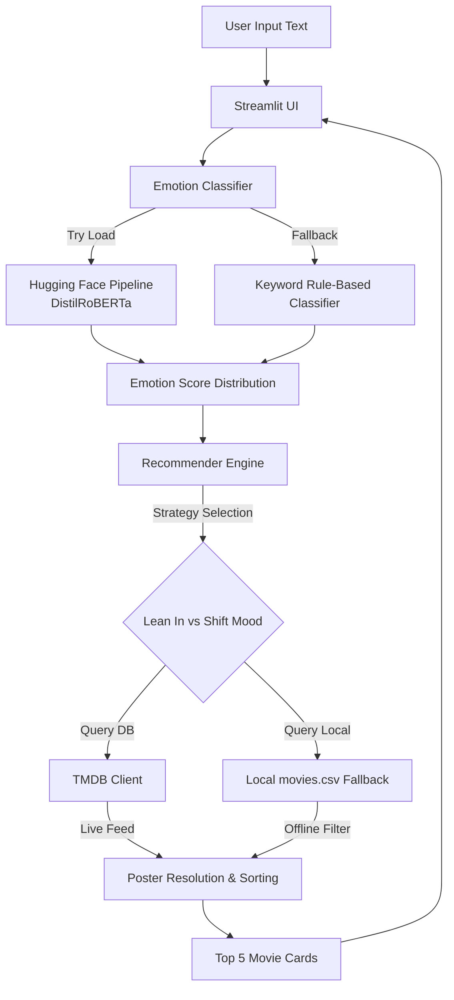

# 🎬 Sentimovie: Emotion-Based Movie Recommendation System

[](https://github.com/your-username/movie-recommendation/actions)
[](LICENSE)
[](https://www.python.org/)
[](https://streamlit.io/)

Sentimovie is an end-to-end, production-grade, AI-driven movie recommendation application. By analyzing the emotional undertones of a user's typed mood (e.g., *"I had a rough day at work, make me laugh"*), Sentimovie classifies the emotion and matches it to targeted movie recommendations. 

The application is built to be **offline-first and hybrid**—it runs a local deep learning classifier on your CPU and can fallback to a bundled offline database if internet access or API limits prevent live TMDB connection.

---

## 🎨 User Interface (Preview)

> [!NOTE]
> *UI Screenshot placeholder. Once deployed locally, you'll see a premium responsive dark interface with emotion progress distributions and movie posters.*


---

## 🏗️ Architecture & Workflow

Sentimovie uses a modular design separating natural language classification, client-side API querying, and user presentation.



### Emotion to Genre Mapping Strategies

We offer two distinct modes for custom curation:
1. **Shift Mood (Cheer Up/Soothe)**: Recommends movies designed to shift your state (e.g. Comedies or Family films when feeling Sad or Angry).
2. **Lean In (Match Emotion)**: Recommends movies that match your current mood state (e.g. Dramas when Sad, Thrillers/Horror when Fearful).

---

## 🚀 Quick Start

### Prerequisites
- Python 3.10 or higher
- Git

### 1. Clone the Repository
```bash
git clone https://github.com/your-username/movie-recommendation.git
cd movie-recommendation
```

### 2. Set Up Virtual Environment
```bash
python -m venv venv

# On Windows (PowerShell):
.\venv\Scripts\activate

# On macOS/Linux:
source venv/bin/activate
```

### 3. Install Dependencies
```bash
pip install -r requirements.txt
```
*Note: Installing `torch` may take a minute. It will download the CPU-optimized version by default.*

### 4. Configuration (Optional)
Sentimovie works 100% out of the box using our curated offline database. To enable live movie searching and fetching, get a free API Key from [The Movie Database (TMDB)](https://www.themoviedb.org/) and set up your `.env` file:
```bash
cp .env.example .env
```
Open `.env` and fill in your key:
```env
TMDB_API_KEY=your_tmdb_api_key_here
```

### 5. Run the Application
Start the Streamlit interface locally:
```bash
streamlit run src/app.py
```
The interface will open in your browser automatically at `http://localhost:8501`.

---

## 🧪 Testing & Code Quality

We maintain high quality standards with unit tests and formatting configurations.

### Running Unit Tests
Run unit tests checking classifier and recommender logic:
```bash
pytest tests/
```

### Code Style Checking
We use `ruff` to lint and format our codebase:
```bash
# Check lint rules
ruff check .

# Check formatting issues
ruff format --check .

# Auto-apply format fixes
ruff format .
```

---

## 📂 Project Directory Structure

```
movie-recommendation/
│
├── .github/
│   └── workflows/
│       └── ci.yml               # Automated GitHub Action workflow
│
├── data/
│   └── movies.csv               # Curated offline movie database fallback
│
├── src/
│   ├── __init__.py
│   ├── app.py                   # Streamlit Frontend UI
│   ├── config.py                # Global configurations and genre mapping
│   ├── emotion_classifier.py    # HF Deep Learning + Rule-based sentiment analysis
│   ├── recommender.py           # recommendation filter & rank algorithms
│   └── tmdb_client.py           # TMDB live API integrations
│
├── tests/
│   ├── __init__.py
│   ├── test_classifier.py       # Classifier unit tests
│   └── test_recommender.py      # Recommendation unit tests
│
├── .env.example                 # Environment configuration template
├── .gitignore                   # Ignore builds, virtual environments, caches
├── CONTRIBUTING.md              # Open-source contributing guidelines
├── LICENSE                      # MIT Open-Source License
└── requirements.txt             # Project library requirements
```

---

## 🤝 Contributing

We welcome open-source contributions! Please review our [CONTRIBUTING.md](CONTRIBUTING.md) to understand our pull request submission workflow, linting rules, and test protocols.

---

## 📄 License

This project is licensed under the MIT License. See [LICENSE](LICENSE) for details.
